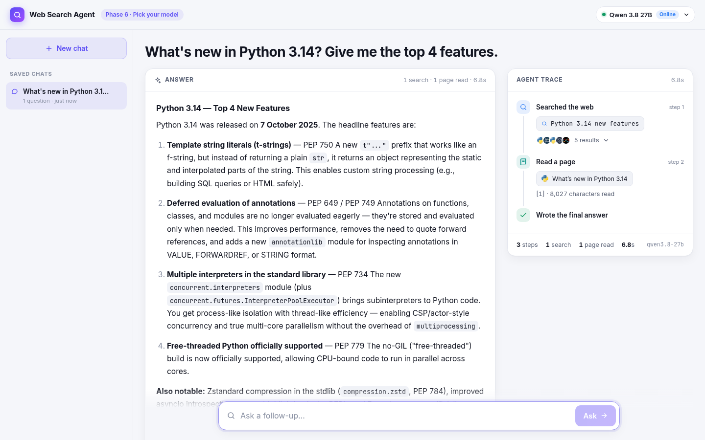
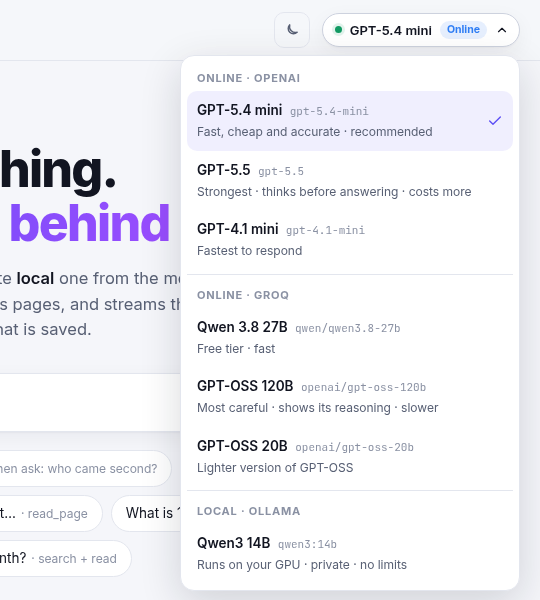

# Web Search Agent

A small AI agent that searches the web, reads pages and answers your questions with sources. You can watch every step it takes while it works.

I built this while learning agentic AI, one phase at a time. There is no agent framework here (no LangChain, no CrewAI). The whole agent loop is plain Python that you can read in one sitting, so you can see exactly what an "agent" really is.



## What it can do

- **Decides by itself** whether it needs to search at all. Ask "what is 17 × 23" and it just answers. Ask about yesterday's news and it goes to the web.
- **Two tools:** `web_search` finds pages and `read_page` opens a page and reads the full text when the search snippets are not enough.
- **Two search engines.** [Tavily](https://tavily.com) is a search API built for AI agents — the snippets are much richer than a normal search, so the agent needs fewer follow-up reads. Without a Tavily key it falls back to DuckDuckGo, which is free and needs no key. The trace shows which one ran.
- **Answers with sources.** Every claim gets a number like [1], and clicking it takes you to that source.
- **Live agent trace.** You see every search query it writes, every page it reads and every mistake it fixes, while it is happening.
- **Streams the answer** word by word, like ChatGPT.
- **Remembers the chat.** Follow-ups like "and who came second?" work. Chats are saved in SQLite, so they are still there after a refresh or restart.
- **Light and dark mode.** It follows your system by default, and there's a toggle in the top bar if you want to force one.
- **Pick your model** from the top bar: fast online models on Groq (free API key), or a local model through Ollama if you already have it running.



## How it works

An agent is basically three things: an LLM (the brain), some tools (the hands) and a loop.

```
          ┌───────────────────────────────────────────────────┐
          │  THINK   the LLM reads the whole conversation     │
          │    │                                              │
          │    ├── wants a tool? ─> ACT: our code runs it     │
          │    │                    OBSERVE: result is added  │
          │    │                    to the conversation ──────┘
          │    │
          │    └── no tool call? ─> that's the final answer, stop
```

This is called the **ReAct** loop (Reason + Act). One important thing that confused me in the beginning: **the LLM never runs any code**. It only *asks* for a tool, by giving a tool name and some JSON arguments. Our Python code runs the tool and puts the result back into the conversation. The LLM only knows about the tools from a short description we send with every request.

The full flow of one question:

```
React UI  ──question──>  FastAPI server  ──>  agent loop  ──>  LLM (Groq / Ollama)
    ^                        │                    │
    │                        │                    └──>  tools: web_search, read_page
    └──── live events ───────┘
          (one JSON per line: thought, tool_call, tool_result, token, answer...)
```

The server streams every step to the browser as it happens (NDJSON), that's how the trace and the answer update live. When a turn finishes, its events are saved in SQLite. Opening an old chat just replays those events, so you get back the full trace and not only the answer.

## Tech stack

| Part | What I used |
|---|---|
| Agent loop | Plain Python, no framework ([ai/agent.py](ai/agent.py)) |
| LLMs | Groq (OpenAI-compatible API) and Ollama, behind one small adapter ([ai/llm.py](ai/llm.py)) |
| Tools | Tavily search API with a `ddgs` (DuckDuckGo) fallback, `trafilatura` for pulling the main text out of a page |
| Backend | FastAPI + Uvicorn, SQLite for saved chats |
| Frontend | React 19 + Vite, plain CSS (light and dark mode), `react-markdown` |

## Getting started

You will need:

- **Python 3.10+**
- **Node.js 18+**
- A free **Groq API key**: sign up at [console.groq.com](https://console.groq.com/keys) and create one. It takes a minute.
- Optional: a free **Tavily API key** from [app.tavily.com](https://app.tavily.com) for better search results. Skip it and DuckDuckGo is used instead.

Then:

```bash
git clone https://github.com/mohitphoenix24/Web-Search-Agent.git
cd Web-Search-Agent
./setup.sh      # only the first time
./launch.sh     # starts the app
```

Open **http://localhost:5180** and ask something.

`setup.sh` checks your Python and Node versions, installs everything (Python packages go into a local `.venv`), asks you to paste your Groq key (and optionally a Tavily key) and then tests the Groq key. The key is saved in a `.env` file, which is git-ignored, so it never gets pushed by mistake. If you prefer, you can also copy `.env.example` to `.env` and put your key there yourself.

`launch.sh` starts the backend (port 8000) and the UI (port 5180) in the background, waits till both are ready and gives you the link. You can close the terminal after that, the app keeps running. If the app is already running, it stops the old copy first, so you never end up with two copies fighting for the same port.

| Command | What it does |
|---|---|
| `./launch.sh` | Start the app, or restart it if it's already running |
| `./launch.sh stop` | Stop it |
| `./launch.sh status` | Check if it's running |
| `./launch.sh logs` | Watch the backend and UI logs (`Ctrl+C` stops watching, not the app) |

It only ever stops *this* app. If some other program is sitting on port 8000 or 5180, it tells you and leaves that program alone.

Prefer to see everything in the terminal? `./start.sh` runs the app in the foreground instead, and `Ctrl+C` stops it.

> **On Windows?** The scripts are bash, so please run them inside WSL.

## Things to try

- `Who won the latest Formula 1 race?` and then `And who came second?` (memory)
- `What is 17 × 23?` (it should answer without any tools)
- `Read https://docs.python.org/3/whatsnew/3.14.html and list the 3 biggest features` (read_page)
- Ask the same question with two different models and compare the traces

## Project structure

```
Web-Search-Agent/
├── ai/                    # the AI side of the project — everything above the API layer
│   ├── agent.py           # the ReAct agent loop, tools menu, memory, citations
│   ├── llm.py             # model list + one adapter for Groq and one for Ollama
│   └── tools.py           # web_search() (Tavily or DuckDuckGo) and read_page()
├── db.py                  # SQLite storage for saved chats
├── server.py              # FastAPI: streams agent events, chat endpoints
├── setup.sh               # one-time setup
├── launch.sh              # start/restart in the background, stop, status, logs
├── start.sh               # same app, but in the foreground
├── requirements.txt
└── frontend/
    └── src/
        ├── App.jsx           # chat state, turns events into UI steps
        ├── api.js            # reads the NDJSON stream
        └── components/       # Trace, Answer, Sources, Sidebar, ModelPicker
```

The `ai/` files also run on their own from the terminal (as modules, with `-m`, since they live inside a package), which is handy while learning:

```bash
.venv/bin/python -m ai.tools                          # try the two tools
.venv/bin/python -m ai.llm                            # every model says hi
.venv/bin/python -m ai.agent                          # a 2-question chat in the terminal
.venv/bin/python -m ai.agent openai/gpt-oss-120b      # same, with another model
```

## How I built it (the phases)

I did not write this in one go. Each phase added one idea on top of the last one, and the comments in the code still say which phase added what.

| Phase | What I added | What I learned |
|---|---|---|
| 1 | A search tool and a basic UI | A tool is just a normal function that returns clean data |
| 2 | LLM reads the search results and answers with sources | RAG: giving the LLM fresh information inside the prompt |
| 3 | The LLM decides itself when and what to search | Tool calling and the ReAct loop, this is where it became an agent |
| 4 | Chat memory + `read_page` tool | Memory is just sending the old conversation again. Adding a tool = a function + a description |
| 5 | Streaming answers + saved chats in SQLite | Tokens, streaming, and moving memory to the server |
| 6 | Model picker (online and local) | Most providers speak the same OpenAI-style API, so one adapter can hide the differences |
| 7 | Tavily search, with DuckDuckGo as fallback | A clean tool interface means you can swap the engine underneath and nothing else changes |

## Things to know

- **Groq's free tier allows 8,000 tokens per minute per model.** A normal question is fine, but a question that needs many searches can hit the limit. The app waits and retries by itself, so the answer just comes slower. You can also switch to another model from the menu, because each model has its own limit.
- **Search can fail sometimes.** DuckDuckGo occasionally refuses a request, so it retries up to 3 times. If Tavily fails (bad key, out of credits, no internet), the agent quietly falls back to DuckDuckGo instead of failing the question.
- **Some websites block bots** (formula1.com, reuters.com for example). When a page can't be read, the agent sees the error and tries another one.
- **Models sometimes write a broken tool call.** Groq rejects it and the agent quietly asks the model to try again (you'll see "wrote a tool call it couldn't finish" in the trace). It happens in roughly 1 out of 5 questions with the smaller models.
- **Answers can still be wrong.** Smaller models especially can misread a page. That's why every answer shows its sources, so please check them for anything important.
- The **local model** (Qwen3 14B) only shows up as available if you already have [Ollama](https://ollama.com) running with `qwen3:14b` pulled. It's optional, the online models work without it.

## Running things separately (while developing)

```bash
# backend, restarts when you change a .py file
.venv/bin/uvicorn server:app --reload --port 8000

# frontend, in another terminal
cd frontend && npm run dev
```

## What's next

The next thing I want to add is **evals**: a small set of test questions, run automatically against each model, so I can actually measure if a prompt change makes the agent better or worse instead of just guessing.

---

Made by Mohit ([@mohitphoenix24](https://github.com/mohitphoenix24)) while learning agentic AI. If this helped you understand agents a little better, do give it a ⭐. Suggestions and PRs are most welcome.
